# PRACTICAL - 1

## Aim
To implement Horner’s method using recursion to represent a polynomial expression efficiently.

## Theory
Horner’s method is an efficient technique used to represent and evaluate polynomials.
It reduces the number of multiplications required by rewriting the polynomial in a nested form.
This approach improves efficiency and simplifies polynomial evaluation.

## Algorithm

1. Start
2. Input coefficients
3. If last element → print
4. Else:
   print "("
   recursive call
   print "x + coefficient"
   print ")"
5. Stop

## Graph
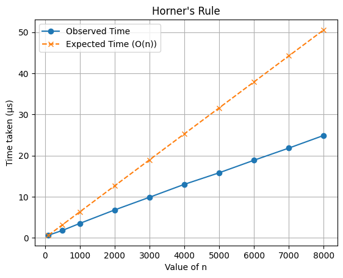
   
## Time Complexity

O(n), where n is the number of coefficients

## Space Complexity

O(n) due to recursive function calls

## Code
```
void hornor(int k, int m, vector<int> &a)
{

    if(k==m-1)
    {
        cout<<a[k];
        return;
    }
    cout<<"(";
    hornor(k+1,m,a);
    cout<<"x + "<<a[k]<<")";
}
```
## What the Code Does

This program prints the polynomial expression using Horner’s method through recursion.

The hornor(k, m, a) function recursively processes the coefficients of the polynomial stored in the vector a.
When the last coefficient is reached, it is printed and the recursion stops.

For each recursive call, the function prints an opening parenthesis and calls itself for the next coefficient.
After returning from recursion, it prints "x + " followed by the current coefficient and a closing parenthesis.

In the main() function, the number of coefficients is taken as input from the user.
The coefficients are stored in a vector and passed to the recursive function.

The output represents the polynomial in nested Horner’s form.

## Conclusion

Horner’s method provides an efficient way to represent and evaluate polynomials.
Using recursion, the polynomial is expressed in a clean and optimized nested format, reducing computational complexity compared to the standard polynomial form.

# PRACTICAL - 2
## Aim
To implement the Linear Search algorithm using recursion and measure the time taken to search for a key element.

## Theory
Linear Search is a simple searching algorithm that checks each element of the list sequentially until the desired element is found or the list ends.
In the recursive approach, the function compares the current element with the target value.
If a match is found, the index is returned.
Otherwise, the function calls itself for the next index.

This method is easy to understand but inefficient for large datasets.

## Algorithm
1. Start
2. Input array and target
3. If index >= n → return -1
4. If a[index] == target → return index
5. Else call function with next index
6. Stop

## Graph
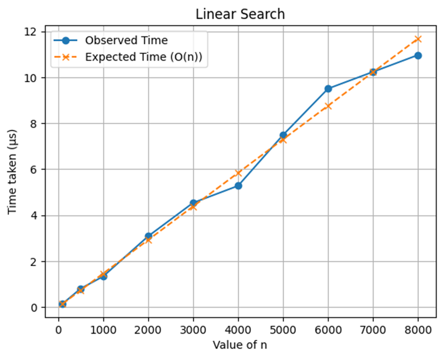
   
## Time Complexity

Best Case: O(1) (key found at first position)
Average Case: O(n)
Worst Case: O(n)

## Space Complexity

O(n) due to recursive function calls

## Code
```
int linearS(vector<int> &a, int target, int j)
{
  if (j == a.size())
    return -1;
  if (a[j] == target)
    return j;
  else
  {
    return linearS(a, target, j + 1);
  }
}
```
## What the Code Does

This program searches for a key element in a list of randomly generated numbers using recursive Linear Search.
The linearS(a, target, j) function recursively checks each element of the vector starting from index j.
If the index reaches the end of the vector, the function returns −1, indicating the key is not found.
If the current element matches the target, the index is returned.
Otherwise, the function calls itself with the next index.

In the main() function, the number of elements is taken as input from the user.
Random numbers are generated and stored in a vector.
A random key value is selected for searching.

The time taken for the search operation is measured using the chrono library and displayed in nanoseconds along with the index result.

## Conclusion

Linear Search successfully finds the target element if it exists in the list.
Although simple to implement, it is inefficient for large datasets due to its linear time complexity.
The recursive approach demonstrates the use of recursion in searching algorithms.

# PRACTICAL - 3

## Aim
To generate all possible permutations of a given string using recursion and backtracking.

## Theory
Permutation generation is the process of arranging the elements of a string in all possible orders.
For a string of length n, the total number of permutations is n!.

This program uses recursion with backtracking to generate permutations.
At each recursive step, the algorithm fixes one character and recursively permutes the remaining characters.
After each recursive call, the original order is restored using backtracking.

## Algorithm
1. Start
2. If k == n → print string
3. Else:
   For i = k to n-1:
      swap
      recursive call
      swap back
4. Stop

## Graph
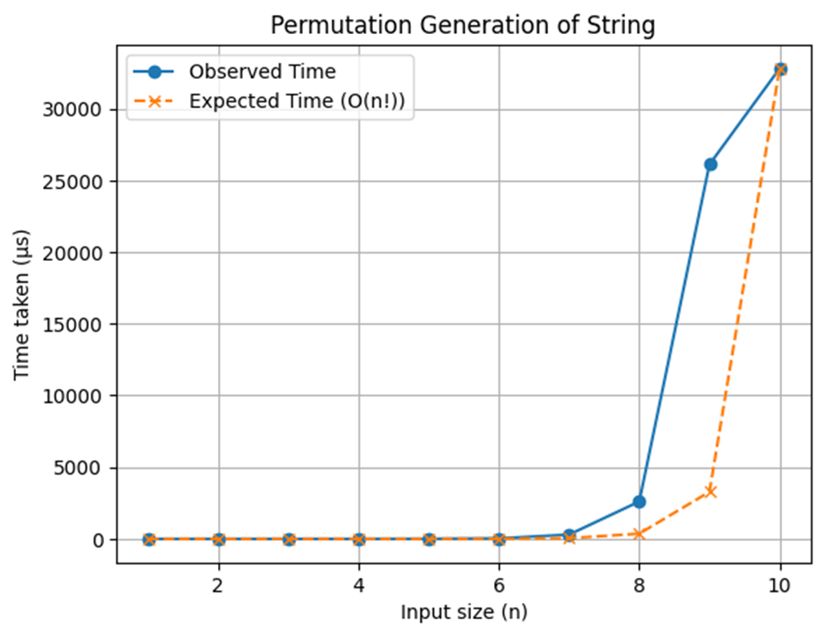
   
## Time Complexity

O(n!), where n is the number of characters

## Space Complexity

O(n) due to recursive call stack

## Code 
```
void permGen(vector<char> &a,int k,int n)
{
    if(k==n) 
    {
        for (char c : a)
            cout << c;
        cout << endl;
        return;
    }
    else{
        for(int i=k;i<n;i++)
        {
            swap(a[i],a[k]);
            permGen(a,k+1,n);
            swap(a[i],a[k]);
        }
    }
} 
```
### Use Cases
- Anagram generation
- Combinatorial problems
- Testing all possible arrangements


## What the Code Does
This program generates and prints all permutations of a string entered by the user.

The permGen(a, k, n) function generates permutations recursively.
If k == n, a complete permutation is formed and printed.
Otherwise, the function iterates from index k to n − 1, swapping the current character with each subsequent character.

After each swap, the function calls itself for the next position (k + 1).
Once the recursive call returns, the characters are swapped back to restore the original order.
This backtracking step ensures all permutations are generated without duplication.
  In the main() function, the number of characters and the string are taken as input from the user.
  The recursive function is then called to display all possible permutations.

## Conclusion
The program successfully generates all permutations of a string using recursion and backtracking.
Although the algorithm is computationally expensive due to factorial time complexity, it is effective for small input sizes and demonstrates the concept of recursive backtracking clearly.

SHere are the README structures for the requested practicals, formatted to match the exact style and detail level of your Tower of Hanoi example.

---

# PRACTICAL - Missing Number in a Sequence

## Aim
To find the missing number in a given sequence of integers from 1 to N.

## Theory
Finding a missing number in a sequence is a classic array problem that can be optimized using mathematical principles. 
If an array contains $N-1$ distinct integers in the range of 1 to $N$, exactly one number is missing. 

Instead of searching for the number iteratively, which can be time-consuming, we can use the mathematical formula for the sum of the first $N$ natural numbers: $S = N(N + 1) / 2$. By subtracting the actual sum of the array's elements from this expected sum, the difference reveals the missing number.

## Algorithm
findMissing(arr, N)

1. Calculate the expected sum: expected_sum = N * (N + 1) / 2
2. Initialize actual_sum = 0
3. For each element i in arr:
4.     actual_sum = actual_sum + i
5. missing_number = expected_sum - actual_sum
6. return missing_number

## Graph
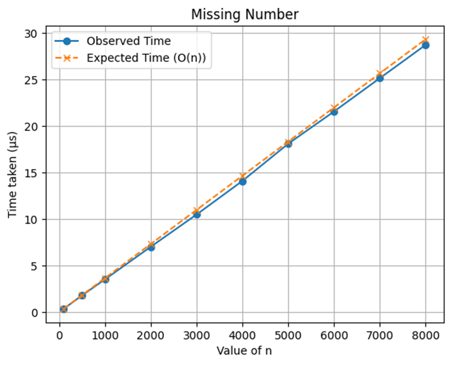

## Time Complexity
O(N), where N is the size of the array.

## Space Complexity
O(1), as no extra space is required.

## Code
```cpp
int findMissingNumber(int arr[], int n) {
    int expectedSum = n * (n + 1) / 2;
    int actualSum = 0;
    
    for(int i = 0; i < n - 1; i++) {
        actualSum += arr[i];
    }
    
    return expectedSum - actualSum;
}
```

### Use Cases
- Data validation and integrity checks.
- Identifying missing packets in network transmissions.
- Finding sequential gaps in database indexing.

## What the Code Does
This program mathematically computes the missing element in a sequence. 
The function `findMissingNumber(arr, n)` first computes what the sum of numbers from 1 to `n` should be. 
It then loops through the provided array (which contains `n-1` elements) to compute the actual sum of the elements present.
Finally, it subtracts the actual sum from the expected sum and returns the result, which is guaranteed to be the missing sequence number.

## Conclusion
The missing number problem is efficiently solved in linear time using a straightforward mathematical formula, bypassing the need for sorting or nested loops and demonstrating the power of math in algorithm optimization.

---

# PRACTICAL - Permutation Generation of Binary Strings

## Aim
To generate all possible binary strings of a given length $n$ using recursion and backtracking.

## Theory
Generating all permutations of binary strings is an excellent demonstration of exploring a state-space tree. 
A binary string of length $n$ can have $2^n$ possible combinations, as each position in the string can be filled with either a '0' or a '1'.

The recursive approach involves moving through each index of an array. At each index, we branch into two paths: one where the current element is set to '0', and one where it is set to '1'. This process continues until we reach the end of the string (the base case).

## Algorithm
generateBinary(n, arr, i)

1. if i == n then
2.     print arr
3.     return
4. arr[i] = 0
5. generateBinary(n, arr, i + 1)
6. arr[i] = 1
7. generateBinary(n, arr, i + 1)

## Graph
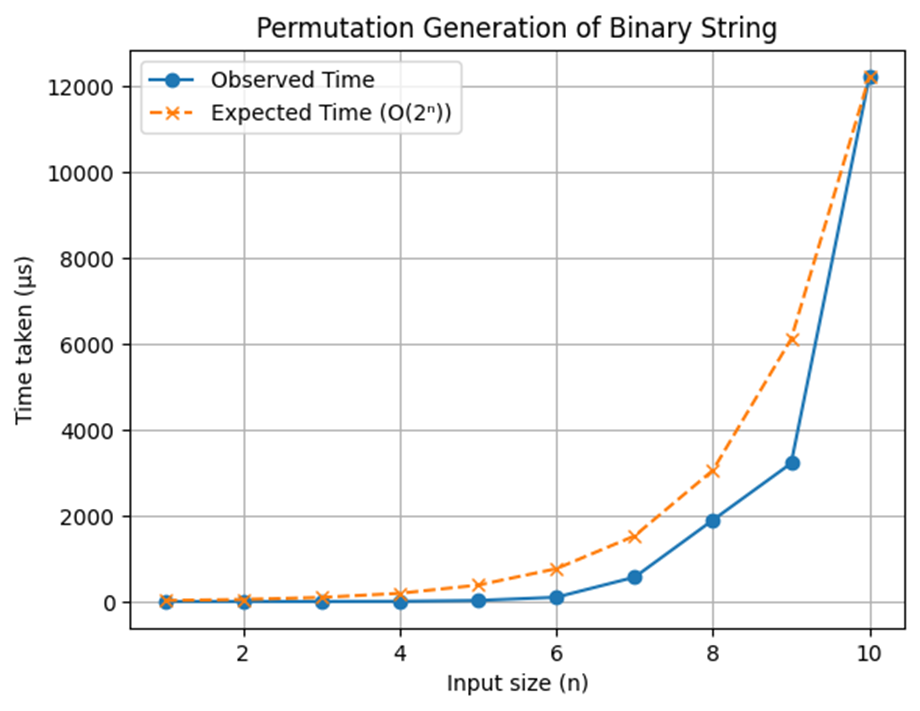

## Time Complexity
O(2ⁿ), where n is the length of the binary string.

## Space Complexity
O(n) due to the recursive call stack.

## Code
```cpp
void generateBinary(int n, int arr[], int i) {
    if (i == n) {
        for (int j = 0; j < n; j++) {
            cout << arr[j];
        }
        cout << endl;
        return;
    }
    
    arr[i] = 0;
    generateBinary(n, arr, i + 1);
    
    arr[i] = 1;
    generateBinary(n, arr, i + 1);
}
```

### Use Cases
- Generating truth tables.
- Exhaustive search algorithms.
- Bitmask generation for subset problems.

## What the Code Does
This program prints every possible binary sequence for a given length `n`.
The `generateBinary(n, arr, i)` function uses `i` to track the current position in the array. 

If `i` equals `n`, it means the array is fully populated, so it prints the current sequence and returns.
Otherwise, it sets the current index to 0 and recursively calls itself to fill the remaining positions. 
Once that recursive call finishes (backtracking), it changes the current index to 1 and makes another recursive call. 
This ensures every combination is systematically explored.

## Conclusion
Permutation generation relies heavily on recursion and backtracking to exhaustively explore all possible states. While it has exponential time complexity, it provides the foundational logic for solving complex combinatorial problems.

---

# PRACTICAL - Power (Iterative)

## Aim
To calculate the power of a number (x^y) using an iterative approach.

## Theory
Calculating the power of a base number `x` raised to an exponent `y` means multiplying `x` by itself `y` times. 
The simplest way to compute this is by using a loop that runs `y` times, maintaining a running product. 

While simple, this linear iterative approach forms the foundation for understanding computational loops and state accumulation before moving on to more optimized methods.

## Algorithm
powerIterative(x, y)

1. Initialize result = 1
2. Loop i from 1 to y:
3.     result = result * x
4. return result

## Graph
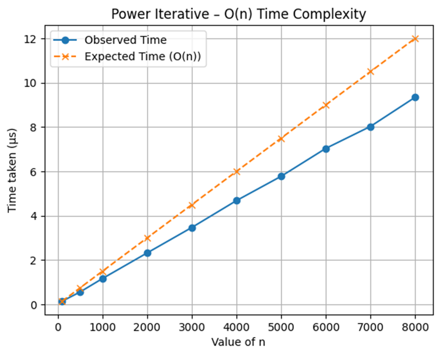

## Time Complexity
O(y), where y is the exponent.

## Space Complexity
O(1), as it uses a constant amount of memory.

## Code
```cpp
long long powerIterative(int x, int y) {
    long long result = 1;
    for (int i = 0; i < y; i++) {
        result *= x;
    }
    return result;
}
```

### Use Cases
- Basic arithmetic operations in software.
- Simple interest / compound interest calculations for small time periods.
- Introduction to loops and accumulators in programming.

## What the Code Does
This program calculates $x^y$ sequentially. 
The function `powerIterative(x, y)` initializes a variable `result` to 1. 
It then enters a `for` loop that iterates exactly `y` times. In each iteration, it multiplies the current `result` by the base `x`. 
Once the loop terminates, it returns the accumulated result. 

## Conclusion
The iterative approach to calculating power is intuitive and uses no extra memory stack. However, for very large exponents, it becomes inefficient compared to divide-and-conquer techniques.

---

# PRACTICAL - Power (Recursive / Divide & Conquer)

## Aim
To calculate the power of a number (x^y) efficiently using the Divide and Conquer strategy.

## Theory
The Divide and Conquer algorithm drastically reduces the number of multiplications needed to calculate $x^y$. 
Instead of multiplying `x` by itself `y` times, we divide the problem in half. 
We know that mathematically:
- If y is even: $x^y = x^{y/2} * x^{y/2}$
- If y is odd: $x^y = x * x^{y/2} * x^{y/2}$

By calculating $x^{y/2}$ only once and reusing it, we cut the problem size in half at each recursive step, leading to logarithmic time complexity.

## Algorithm
powerRecursive(x, y)

1. if y == 0 then return 1
2. temp = powerRecursive(x, y / 2)
3. if y % 2 == 0 then
4.     return temp * temp
5. else
6.     return x * temp * temp

## Graph
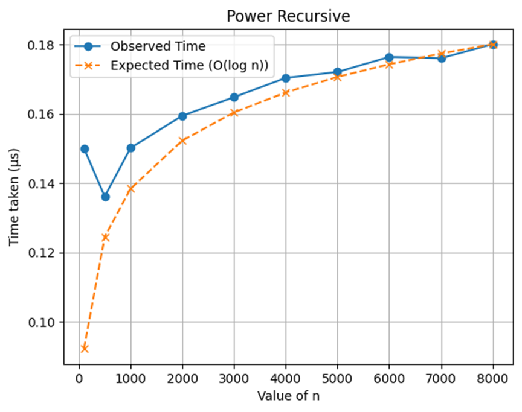

## Time Complexity
O(log y), where y is the exponent.

## Space Complexity
O(log y) due to the recursive call stack.

## Code
```cpp
long long powerRecursive(int x, int y) {
    if (y == 0) return 1;
    
    long long temp = powerRecursive(x, y / 2);
    
    if (y % 2 == 0) {
        return temp * temp;
    } else {
        return x * temp * temp;
    }
}
```

### Use Cases
- Cryptography (e.g., RSA encryption relies heavily on modular exponentiation).
- Computer graphics algorithms.
- Fast computations in scientific calculators.

## What the Code Does
This program efficiently computes exponential values. 
The `powerRecursive(x, y)` function first checks the base case: if the exponent `y` is 0, it returns 1. 
Otherwise, it makes a single recursive call to calculate the power of `x` raised to `y/2`, storing it in `temp`. 

It then checks if the exponent is even or odd. If even, it simply squares `temp`. If odd, it squares `temp` and multiplies it by one additional `x`. This avoids redundant calculations.

## Conclusion
The Divide and Conquer approach optimizes exponentiation significantly, reducing linear time complexity to logarithmic time complexity. It serves as a prime example of how algorithmic strategy can vastly improve performance.

---

# PRACTICAL - Sum of Arrays

## Aim
To calculate the total sum of all elements present in an array.

## Theory
Calculating the sum of an array is a fundamental data structure operation that involves traversing a linear collection of elements. 
The process requires an accumulator variable initialized to zero. As the algorithm visits each index of the array, it adds the value at that index to the accumulator. 
This sequential processing is the basis for many other array operations, such as finding averages or aggregating data.

## Algorithm
arraySum(arr, n)

1. Initialize sum = 0
2. Loop i from 0 to n-1:
3.     sum = sum + arr[i]
4. return sum

## Graph
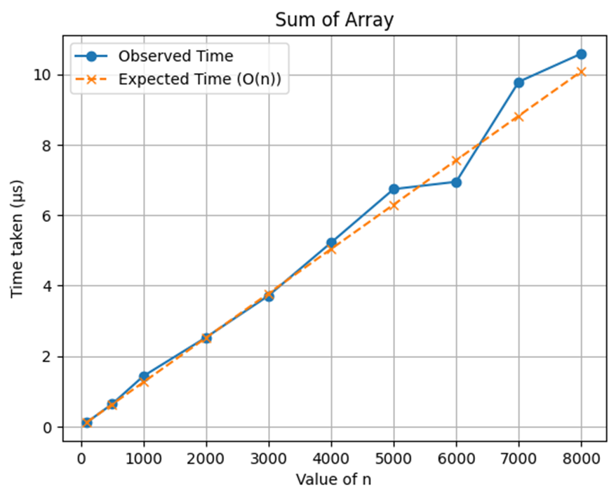

## Time Complexity
O(N), where N is the number of elements in the array.

## Space Complexity
O(1), as no auxiliary space is required.

## Code
```cpp
int sumOfArray(int arr[], int n) {
    int sum = 0;
    for(int i = 0; i < n; i++) {
        sum += arr[i];
    }
    return sum;
}
```

### Use Cases
- Statistical analysis (calculating mean).
- Accumulating scores or financial totals in applications.
- Evaluating objective functions in machine learning.

## What the Code Does
This program iteratively adds up all the integers in an array.
The `sumOfArray(arr, n)` function sets an integer variable `sum` to 0. 
It then uses a `for` loop to traverse the array from index 0 up to `n-1`. 
During each iteration, the current element `arr[i]` is added to the `sum` variable. 
After the loop visits every element, the total `sum` is returned to the caller.

## Conclusion
Finding the sum of an array is a straightforward, linear operation that demonstrates basic array traversal and the use of accumulator variables, acting as a stepping stone for more complex data manipulation tasks.

# PRACTICAL -9
## Aim
To solve the Tower of Hanoi problem using recursion and display the sequence of moves required to transfer the disks.

## Theory
The Tower of Hanoi is a classical problem that demonstrates the concept of recursion.
It consists of three pegs: source, destination, and auxiliary.

The objective is to move n disks from the source peg to the destination peg by following these rules:
Only one disk can be moved at a time.
A larger disk cannot be placed on top of a smaller disk.
An auxiliary peg can be used for intermediate moves.
The recursive solution breaks the problem into smaller subproblems until the base case is reached.

## Algorithm
TOH(n, source, destination, auxiliary)

1. if n = 1 then
2.     print move source → destination
3. else
4.     TOH(n-1, source, auxiliary, destination)
5.     print move source → destination
6.     TOH(n-1, auxiliary, destination, source)

   
## Time Complexity

O(2ⁿ), where n is the number of disks
## Space Complexity

O(n) due to recursive call stack

## Code
```
void TOH(int n,int src,int dest, int ext){
    if(n==1) cout<<"move disk from "<<src<<"->"<<dest<<endl;
    else{
        TOH(n-1,src,ext,dest);
        cout<<"move disc from " <<src<<"-> "<<dest<<endl;
        TOH(n-1,ext,dest,src);
    }
}
```

### Use Cases
- Understanding recursion deeply
- Algorithm design using divide-and-conquer
- Puzzle solving and state transitions

## What the Code Does
This program prints the steps required to solve the Tower of Hanoi problem using recursion.
The TOH(n, src, dest, ext) function moves n disks from the source peg to the destination peg using an auxiliary peg.

If n == 1, the function directly moves the disk from the source to the destination.
Otherwise, it first moves n − 1 disks from the source peg to the auxiliary peg.
Then it moves the largest disk from the source peg to the destination peg.
Finally, it moves the n − 1 disks from the auxiliary peg to the destination peg.

In the main() function, the number of disks is taken as input from the user, and the recursive function is called to display all the moves.

## Conclusion
The Tower of Hanoi problem is efficiently solved using recursion by breaking it into smaller subproblems.
Although the number of moves grows exponentially, the problem clearly illustrates recursive thinking and divide-and-conquer strategy.


# Practical: Find First Duplicate

### Aim
To find the first duplicate element in an array — the element that appears more than once and has the **smallest index** of its second occurrence.

---

### Theory
Finding the first duplicate in an array is a classic searching problem with multiple approaches:

Key idea:
- A **duplicate** is an element that appears more than once in the array
- The **first duplicate** is defined by the earliest second occurrence
- Using a **hash set** allows O(1) lookup to detect if an element has been seen before

Approaches:
- **Brute Force**: Compare every pair — O(n²) time
- **Hashing**: Track seen elements using a set — O(n) time, O(n) space
- **In-place marking**: For arrays with values in range [1, n] — O(n) time, O(1) space

---

### Algorithm
1. Start
2. Input array `arr[]` of size `n`
3. Create an empty hash set `seen`
4. For each element `x` in `arr[]`:
   - If `x` is already in `seen`:
     - Return `x` as the first duplicate
   - Else:
     - Insert `x` into `seen`
5. If no duplicate found, return -1
6. Stop

---

## Graph
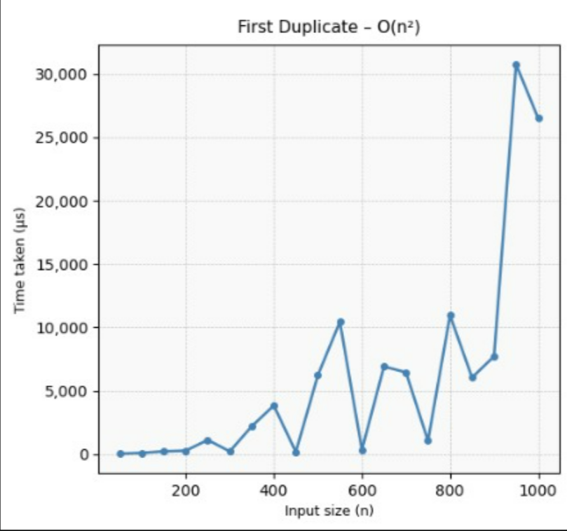

### Time Complexity

| Case         | Complexity |
|--------------|------------|
| Best Case    | O(1)       |
| Average Case | O(n)       |
| Worst Case   | O(n)       |

---

### Space Complexity
- O(n) — for the hash set storing visited elements

---

### Code
```cpp
#include <iostream>
#include <vector>
#include <unordered_set>
using namespace std;

int findFirstDuplicate(vector<int>& arr) {
    unordered_set<int> seen;

    for (int x : arr) {
        if (seen.count(x)) {
            return x;        // First duplicate found
        }
        seen.insert(x);
    }
    return -1;               // No duplicate exists
}

int main() {
    vector<int> arr = {2, 3, 1, 0, 5, 3, 4, 1};

    int result = findFirstDuplicate(arr);

    if (result != -1)
        cout << "First duplicate: " << result << endl;
    else
        cout << "No duplicate found." << endl;

    return 0;
}
```

---

### What the Code Does

- The program takes an integer array as input
- The `findFirstDuplicate()` function:
  - Iterates through the array once
  - Uses an `unordered_set` to track all seen elements
  - Returns the first element that is found already in the set
- The program outputs:
  - The first duplicate element, or
  - A message indicating no duplicates exist

---

### Sample Output
```
First duplicate: 3
```

---

### Conclusion
Finding the first duplicate using hashing is an efficient approach with O(n) time complexity.
It avoids the quadratic cost of brute-force comparison and provides a clean, readable solution.
This technique is widely applicable in data validation, stream processing, and preprocessing pipelines.


# Practical-10: Insertion Sort
## Aim

To implement the Insertion Sort algorithm and analyze its execution time.

## Theory

Insertion Sort is a simple sorting algorithm that works by inserting elements into their correct position in a sorted part of the array.
The array is divided into sorted and unsorted parts.
Elements from the unsorted part are picked one by one and placed at the correct position in the sorted part.
It is similar to sorting playing cards in hand.
Insertion Sort is easy to understand but inefficient for large inputs.

## Graph
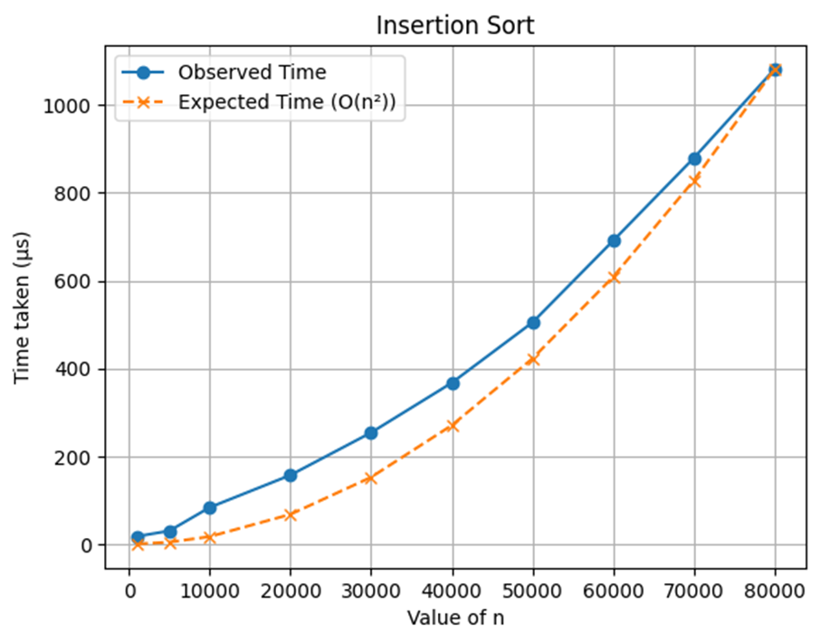

## Algorithm
InsertionSort(A, n)

1. for i ← 2 to n do
2.     key ← A[i]
3.     j ← i-1
4.     while j ≥ 1 and A[j] > key do
5.         A[j+1] ← A[j]
6.         j ← j-1
7.     end while
8.     A[j+1] ← key

## Time Complexity

Best Case: O(n) (already sorted array)
Average Case: O(n²)
Worst Case: O(n²) (reverse sorted array)

## Space Complexity

O(1) (in-place sorting)

## Code 
```
void insertionS(vector<int> &a,int n)
{
    for(int j=2;j<n;j++)
    {
        int key=a[j];
        int i=j-1;
        while (i>0 && a[i]>key)
        {
            a[i+1]=a[i];
            i=i-1;
        }
        a[i+1]=key;
    }
}
```

## What the Code Does

The program generates random elements and stores them in a vector.
The function insertionS() sorts the array:
It selects a key element.
Shifts all larger elements one position to the right.
Inserts the key at its correct position.
The execution time is measured using the chrono library.
The array size and execution time are written into insertionS.txt.

## Conclusion

Insertion Sort correctly sorts the array using a simple approach.
Although it is inefficient for large datasets, it is useful for small inputs and nearly sorted arrays.

# Practical-11: Merge Sort

### Aim
To implement the Merge Sort algorithm and analyze its execution time.

### Theory
Merge Sort is a **divide-and-conquer** sorting algorithm.  
It works by recursively dividing the array into smaller subarrays, sorting them, and then merging them back together.

The process involves:
- Dividing the array into two halves
- Recursively sorting each half
- Merging the sorted halves into a single sorted array

Unlike simple sorting algorithms, Merge Sort is efficient for large datasets due to its logarithmic division strategy.

### Algorithm
MergeSort(A, low, high)

1. if low < high then
2.     mid ← (low + high)/2
3.     MergeSort(A, low, mid)
4.     MergeSort(A, mid+1, high)
5.     Merge(A, low, mid, high)

## Graph
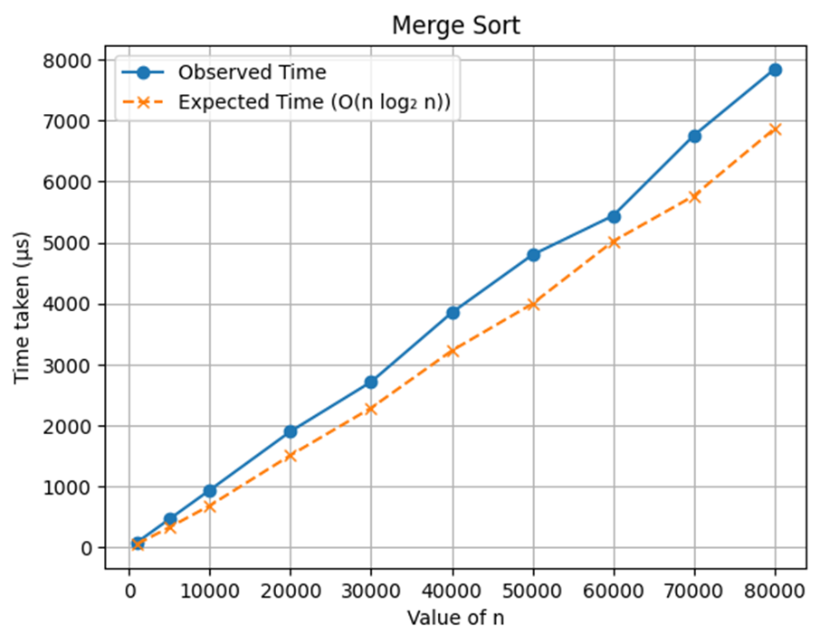

### Time Complexity

| Case        | Complexity   |
|------------|-------------|
| Best Case   | O(n log n)  |
| Average Case| O(n log n)  |
| Worst Case  | O(n log n)  |


### Space Complexity
- O(n) (requires additional space for merging)

## Code
```
void merge(vector<int> &arr, int st, int mid, int end)
{
    vector<int> temp;
    int i = st, j = mid + 1;

    while (i <= mid && j <= end)
    {
        if (arr[i] <= arr[j])
            temp.push_back(arr[i++]);
        else
            temp.push_back(arr[j++]);
    }

    while (i <= mid)
        temp.push_back(arr[i++]);
    while (j <= end)
        temp.push_back(arr[j++]);

    for (int idx = 0; idx < temp.size(); idx++)
        arr[st + idx] = temp[idx];
}

void mergeSort(vector<int> &arr, int st, int end)
{
    if (st >= end)
        return;

    int mid = st + (end - st) / 2;
    mergeSort(arr, st, mid);
    mergeSort(arr, mid + 1, end);
    merge(arr, st, mid, end);
}
```

### What the Code Does

- The program generates arrays of different sizes.
- Each array is filled with sequential values and then shuffled randomly.
- The `mergeSort()` function:
  - Recursively divides the array into halves
  - Calls `merge()` to combine sorted subarrays
- The `merge()` function:
  - Compares elements from two halves
  - Merges them into a temporary vector in sorted order
- The sorting process is repeated **1000 times** for each input size to calculate average execution time.
- Execution time is measured using the `chrono` library.
- The program outputs the **average time (in milliseconds)** for each input size.

---

### Conclusion
Merge Sort efficiently sorts large datasets with a guaranteed time complexity of **O(n log n)**.  
Although it requires extra memory, it is significantly faster and more stable compared to algorithms like Insertion Sort for large inputs.

# Practical-14: Quick Sort

### Aim
To implement the Quick Sort algorithm and analyze its execution time.

---

### Theory
Quick Sort is a **divide-and-conquer** sorting algorithm.  
It works by selecting a **pivot element** and partitioning the array such that:
- Elements smaller than the pivot are placed on the left
- Elements greater than the pivot are placed on the right

The process is then recursively applied to the left and right subarrays.

In this implementation, the pivot is chosen as the **middle element**, and elements are rearranged around it using a custom partitioning approach.

---

### Graph


---

### Algorithm 

---
QuickSort(A, low, high)

1. if low < high then
2.     p ← Partition(A, low, high)
3.     QuickSort(A, low, p-1)
4.     QuickSort(A, p+1, high)

---   

## Graph
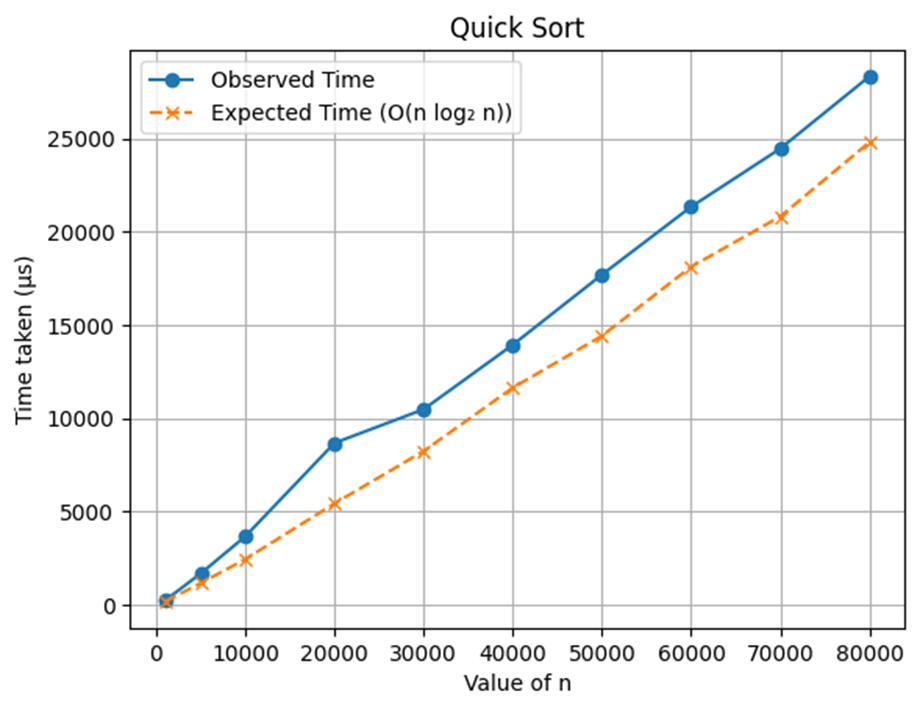

### Time Complexity

 Case          Complexity   
 Best Case :    O(n log n)  
 Average Case : O(n log n)  
 Worst Case  :  O(n²)       

---

### Space Complexity
- O(log n) (due to recursion stack)

---

### Code
```
int partitionFunc(vector<int> &arr, int s, int e)
{
    int m = s + (e - s) / 2;
    int index = s;

    for (int i = s; i <= e; i++)
    {
        if (arr[i] < arr[m])
            index++;
    }

    swap(arr[m], arr[index]);

    int l = s;
    int h = e;

    while (l < index && h > index)
    {
        while (arr[l] < arr[index])
            l++;
        while (arr[h] > arr[index])
            h--;
        if (l < h)
        {
            swap(arr[l], arr[h]);
            l++;
            h--;
        }
    }
    return index;
}

void quickSort(vector<int> &arr, int s, int e)
{
    if (s < e)
    {
        int j = partitionFunc(arr, s, e);
        quickSort(arr, s, j - 1);
        quickSort(arr, j + 1, e);
    }
}
```

---

### What the Code Does

- The program generates arrays of different sizes.
- Each array is filled with sequential values and then shuffled randomly.
- The `quickSort()` function:
  - Selects a pivot using the `partitionFunc()`
  - Recursively sorts elements before and after the pivot
- The `partitionFunc()`:
  - Chooses the middle element as pivot
  - Places the pivot at its correct position
  - Rearranges elements such that smaller elements are on the left and larger on the right
- The sorting process is repeated **1000 times** for each input size to compute average execution time.
- Execution time is measured using the `chrono` library.
- The program outputs the **average time (in milliseconds)** for each input size.

---

### Conclusion
Quick Sort is one of the fastest sorting algorithms in practice due to its efficient partitioning strategy.  
However, its worst-case complexity is **O(n²)**, which can occur when poor pivot choices are made.  
Despite this, it performs exceptionally well on average and is widely used in real-world applications.

# Practical-15: Binary Search

### Aim
To implement the Binary Search algorithm and analyze its execution time.

---

### Theory
Binary Search is an efficient searching algorithm that works on **sorted arrays**.  
It repeatedly divides the search space into smaller parts by comparing the target element with the middle element.

Steps involved:
- Find the middle element of the array
- If the target matches the middle element, return the index
- If the target is smaller, search in the left half
- If the target is larger, search in the right half

This process continues until the element is found or the search space becomes empty.

---

### Algorithm
---
BinarySearch(A, low, high, x)
Input: Sorted array A, indices low & high, target x
Output: Index of x or -1

1. if low > high then
2.     return -1
3. mid ← (low + high) / 2
4. if A[mid] = x then
5.     return mid
6. if x < A[mid] then
7.     return BinarySearch(A, low, mid-1, x)
8. else
9.     return BinarySearch(A, mid+1, high, x)


## Graph
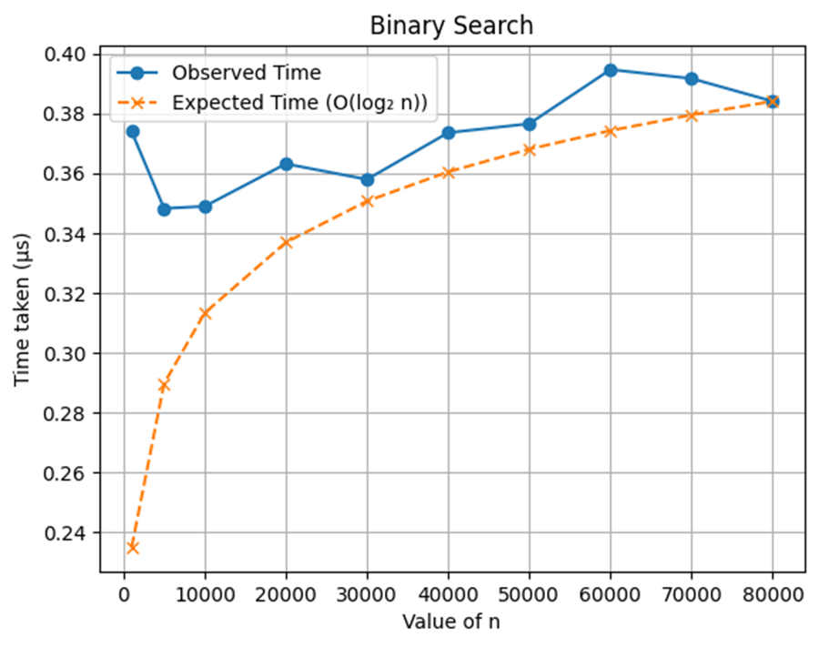
---
### Time Complexity

 Case          Complexity 
 Best Case  :   O(1)      
 Average Case : O(log n)  
 Worst Case  :  O(log n)  

---

### Space Complexity
- O(log n) (due to recursion stack)

---

### Code
```
int binaryS(vector<int> &a, int s, int e, int target)
{
    while (s < e)
    {
        int m = s+(e-s)/3;

        if (a[m] == target)
            return m;
        else if (a[m] < target)
            return binaryS(a, m + 1, e, target);
        else
            return binaryS(a, s, m - 1, target);
    }
}
```

---

### What the Code Does

- The program generates arrays of different sizes.
- Each array is initially filled with sequential values.
- The array is then shuffled randomly.
- A target element is selected from the array.
- The `binaryS()` function:
  - Recursively searches for the target element
  - Divides the array into smaller parts based on comparison
- The searching process is repeated **1000 times** for each input size to calculate average execution time.
- Execution time is measured using the `chrono` library.
- The program outputs the **average time (in milliseconds)** for each input size.

---

### Conclusion
Binary Search is a highly efficient searching algorithm with **O(log n)** time complexity.  
It significantly reduces the number of comparisons compared to linear search.  
However, it requires the data to be **sorted**, which is a key limitation.

# Practical: Matrix Multiplication

### Aim
To multiply two matrices and produce a resultant matrix by performing the standard row-by-column dot product operation.

---

### Theory
Matrix Multiplication is a fundamental operation in linear algebra and computer science.

Key idea:
- Two matrices **A (m×n)** and **B (n×p)** can be multiplied only if the **number of columns of A equals the number of rows of B**
- The result is a matrix **C (m×p)**
- Each element `C[i][j]` is computed as the dot product of the i-th row of A and j-th column of B

Formula:
```
C[i][j] = Σ (A[i][k] * B[k][j])   for k = 0 to n-1
```

Properties:
- Matrix multiplication is **associative**: (AB)C = A(BC)
- Matrix multiplication is **not commutative**: AB ≠ BA in general
- It is **distributive** over addition: A(B + C) = AB + AC

---

### Algorithm
1. Start
2. Input matrix A of size m×n and matrix B of size n×p
3. Check compatibility: columns of A must equal rows of B
4. Initialize result matrix C of size m×p with all zeros
5. For i = 0 to m-1:
   - For j = 0 to p-1:
     - For k = 0 to n-1:
       - C[i][j] += A[i][k] * B[k][j]
6. Output matrix C
7. Stop

---
## Graph
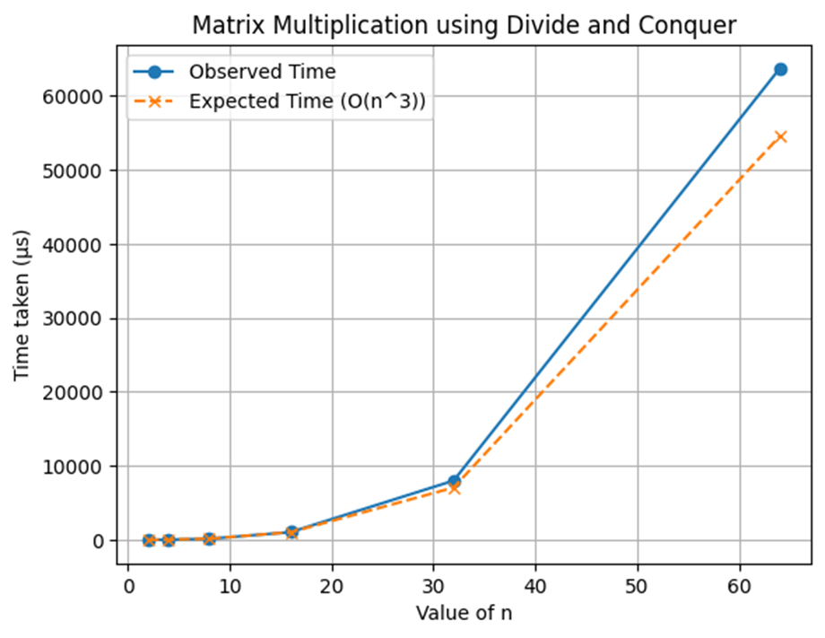

### Time Complexity

| Case         | Complexity |
|--------------|------------|
| Best Case    | O(n³)      |
| Average Case | O(n³)      |
| Worst Case   | O(n³)      |

> For square matrices of size n×n. General case is O(m × n × p).

---

### Space Complexity
- O(m × p) — for storing the resultant matrix C

---

### Code
```cpp
#include <iostream>
#include <vector>
using namespace std;

vector<vector<int>> multiplyMatrices(vector<vector<int>>& A,
                                      vector<vector<int>>& B,
                                      int m, int n, int p) {
    // Initialize result matrix with zeros
    vector<vector<int>> C(m, vector<int>(p, 0));

    for (int i = 0; i < m; i++) {
        for (int j = 0; j < p; j++) {
            for (int k = 0; k < n; k++) {
                C[i][j] += A[i][k] * B[k][j];
            }
        }
    }
    return C;
}

void printMatrix(vector<vector<int>>& mat) {
    for (auto& row : mat) {
        for (int val : row)
            cout << val << "\t";
        cout << endl;
    }
}

int main() {
    
    vector<vector<int>> A = {
        {1, 2},
        {3, 4},
        {5, 6}
    };

   
    vector<vector<int>> B = {
        {7, 8, 9},
        {10, 11, 12}
    };

    int m = 3, n = 2, p = 3;

    cout << "Matrix A:" << endl;
    printMatrix(A);

    cout << "\nMatrix B:" << endl;
    printMatrix(B);

    vector<vector<int>> C = multiplyMatrices(A, B, m, n, p);

    cout << "\nResultant Matrix C = A x B:" << endl;
    printMatrix(C);

    return 0;
}
```

---

### What the Code Does

- The program defines two matrices A (3×2) and B (2×3)
- The `multiplyMatrices()` function:
  - Uses three nested loops to compute each element of the result matrix
  - Accumulates the dot product of each row of A with each column of B
- The `printMatrix()` function displays any matrix in grid format
- The program outputs:
  - Matrix A and Matrix B
  - The resulting product matrix C

---

### Sample Output
```
Matrix A:
1    2
3    4
5    6

Matrix B:
7    8    9
10   11   12

Resultant Matrix C = A x B:
27   30   33
61   68   75
95   106  117
```

---

### Conclusion
Matrix Multiplication is a core operation in fields like computer graphics, machine learning, and scientific computing.
The standard triple-loop algorithm runs in O(n³) time and is simple to implement.
Optimized algorithms like Strassen's reduce this to approximately O(n^2.81), suitable for very large matrices.


# Practical-17: Convex Hull 

### Aim
To implement the Convex Hull algorithm  and analyze its execution.

---

### Theory
The Convex Hull of a set of points is the smallest convex polygon that encloses all given points.

The Monotonic Chain algorithm (Andrew’s Algorithm) is an efficient method to compute the convex hull in O(n log n) time.

Steps involved:
- Sort all points based on x-coordinate (and y if tie)
- Build the lower hull by traversing left to right
- Build the upper hull by traversing right to left
- Remove duplicate points
- Combine both hulls to form the final convex hull

---
### Algorithm
ConvexHull(P)
Input: Set of points P
Output: Convex hull points

1. Sort points in increasing order of x-coordinate
2. Initialize empty list L (lower hull)

3. for each point p in P do
4.     while size(L) ≥ 2 and orientation(last2, last1, p) ≤ 0 do
5.         remove last point from L
6.     end while
7.     append p to L
8. end for

9. Initialize empty list U (upper hull)

10. for each point p in reverse order do
11.     while size(U) ≥ 2 and orientation(last2, last1, p) ≤ 0 do
12.         remove last point from U
13.     end while
14.     append p to U
15. end for

16. Remove last element of L and U
17. return concatenation of L and U

---

## Graph
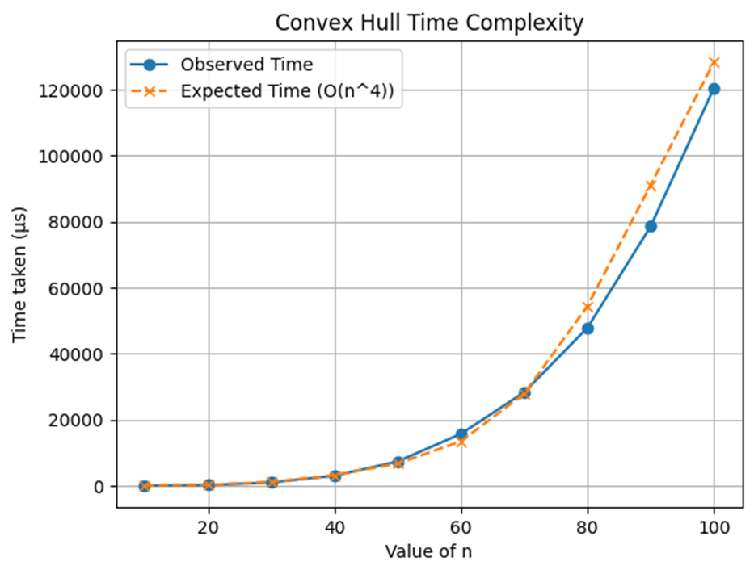

### Time Complexity

 Case     :     Complexity 
 Best Case   :   O(n log n) 
 Average Case : O(n log n) 
 Worst Case  :  O(n log n) 

---

### Space Complexity
- O(n) for storing hull points

---

### Code
```

struct Point {
    int x, y;
};

int orientation(Point p, Point q, Point r) {
    return (q.y - p.y) * (r.x - q.x) -
           (q.x - p.x) * (r.y - q.y);
}

vector<Point> convexHull(vector<Point>& points) {
    int n = points.size();
    if (n <= 1) return points;

    sort(points.begin(), points.end(), [](Point a, Point b) {
        if (a.x == b.x) return a.y < b.y;
        return a.x < b.x;
    });

    vector<Point> lower, upper;

    for (Point p : points) {
        while (lower.size() >= 2 &&
               orientation(lower[lower.size()-2],
                           lower[lower.size()-1], p) >= 0) {
            lower.pop_back();
        }
        lower.push_back(p);
    }

    for (int i = n - 1; i >= 0; i--) {
        Point p = points[i];
        while (upper.size() >= 2 &&
               orientation(upper[upper.size()-2],
                           upper[upper.size()-1], p) >= 0) {
            upper.pop_back();
        }
        upper.push_back(p);
    }

    lower.pop_back();
    upper.pop_back();

    lower.insert(lower.end(), upper.begin(), upper.end());

    return lower;
}
```

---

### What the Code Does

- The program takes a set of 2D points as input.
- Points are sorted based on their coordinates.
- The `orientation()` function determines the turn direction of three points.
- The `convexHull()` function:
  - Builds the lower hull
  - Builds the upper hull
  - Removes unnecessary points that do not form a convex boundary
- Both hulls are merged to produce the final convex hull.
- The program outputs the points forming the convex boundary.

### Conclusion
The Monotonic Chain algorithm efficiently computes the convex hull with O(n log n) time complexity.  
It is simple to implement and works well for large datasets.  
It avoids unnecessary computations by constructing the hull using geometric properties.


## Practical-18: Fractional Knapsack 

### Aim
To implement the Fractional Knapsack algorithm using a greedy approach and analyze its execution time.

---

### Theory
The Fractional Knapsack problem is an optimization problem where the goal is to maximize total value within a given capacity.

Unlike the 0/1 Knapsack:
- Items **can be broken into fractions**
- You can take a portion of an item instead of the whole

Greedy strategy:
- Compute **value-to-weight ratio (value/weight)** for each item
- Sort items in **descending order of ratio**
- Pick items greedily:
  - Take full item if capacity allows
  - Otherwise, take fractional part


---
### Graph 
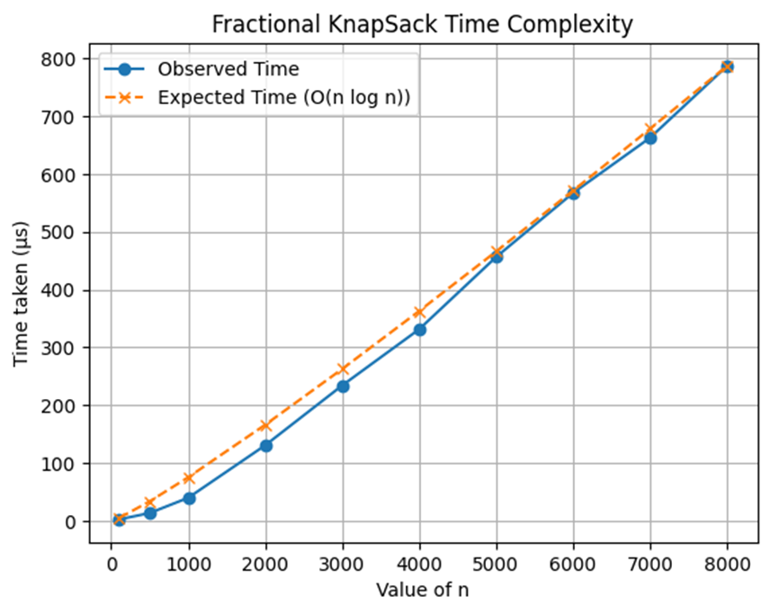

---

### Algorithm
FractionalKnapsack(W, items)
Input: Capacity W, list of items (value, weight)
Output: Maximum value

1. for each item i do
2.     compute ratio[i] ← value[i] / weight[i]
3. sort items in decreasing order of ratio

4. totalValue ← 0

5. for each item i do
6.     if weight[i] ≤ W then
7.         W ← W - weight[i]
8.         totalValue ← totalValue + value[i]
9.     else
10.        totalValue ← totalValue + ratio[i] * W
11.        break
12. return totalValue

---
### Time Complexity

 Case         Complexity  
 Best Case  :  O(n log n)  
 Average Case : O(n log n)  
 Worst Case  :  O(n log n)  

---

### Space Complexity
- O(n) (for storing items)

---

### Code
```
void bubbleS(vector<pair<float,float>> &a)
{
    for (int i = 0; i < a.size(); i++)
    {
        for (int j = 0; j < a.size()-i-1; j++)
        {
            float r1=a[j].first/a[j].second;
            float r2=a[j+1].first/a[j+1].second;

            if (r1<r2)
            {
                swap(a[j],a[j+1]);
            }
            
        }
    }
    
}
float knapSack(vector<pair<float,float>> &a,int capacity)
{
    bubbleS(a);
    float totalValue=0;
    //float r[5];
    for (int j = 0; j< a.size(); j++)
    {
        int value=a[j].first;
        int weight=a[j].second;

        if(capacity>=weight)
        {
            capacity-=weight;
            totalValue+=value;
        }
        else
        {
            totalValue+=((float)value/weight)*capacity;
        }
    }
    return totalValue;
}

```

---

### What the Code Does

- The program generates random items:
  - Each item has a **value** and a **weight**
- The `generateItems()` function:
  - Creates `n` items with random values and weights
- The `bubbleS()` function:
  - Sorts items based on **value-to-weight ratio** in descending order
- The `knapSack()` function:
  - Iterates through sorted items
  - Adds full item if capacity allows
  - Otherwise adds fractional value of remaining capacity
- The process is repeated **50 times** for each input size to calculate average execution time
- Execution time is measured using the `chrono` library
- The program outputs the **average time (in milliseconds)** for each input size

---

### Conclusion
The Fractional Knapsack algorithm efficiently maximizes value using a greedy approach.  
It performs well due to sorting based on value-to-weight ratio and allows partial selection of items.  
This makes it significantly more efficient than the 0/1 Knapsack for large datasets.


## Practical-21: Dijkstra’s Algorithm 

### Aim
To implement Dijkstra’s algorithm to find the shortest path from a source vertex to all other vertices in a graph and analyze its execution time.

---

### Theory
Dijkstra’s Algorithm is a **greedy algorithm** used to find the shortest path in a graph with **non-negative edge weights**.

Steps involved:
- Initialize distances from the source to all vertices as infinity
- Set distance of source vertex to 0
- Select the unvisited vertex with the smallest distance
- Update distances of its neighboring vertices
- Mark the vertex as visited
- Repeat until all vertices are processed

This implementation uses an **adjacency matrix** and a simple linear search to find the minimum distance vertex.


---

### Algorithm
Dijkstra(G, n, source)

1. for each vertex v do
2.     dist[v] ← ∞
3. dist[source] ← 0
4. while there exists unvisited vertex do
5.     u ← vertex with minimum dist
6.     mark u visited
7.     for each neighbor v of u do
8.         if dist[v] > dist[u] + weight(u,v) then
9.             dist[v] ← dist[u] + weight(u,v)

---

## Graph
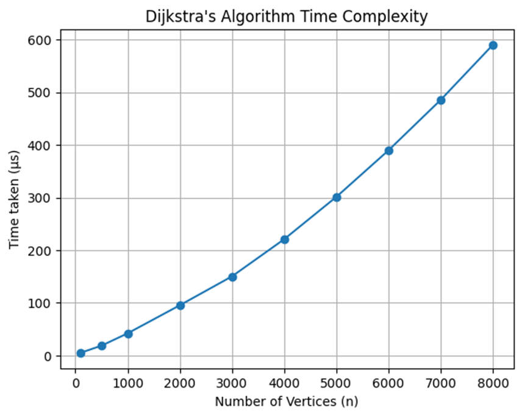

### Time Complexity

 Case          Complexity 
 Best Case   :  O(n²)     
 Average Case : O(n²)     
 Worst Case  :  O(n²)     

---

### Space Complexity
- O(n²) (adjacency matrix)
- O(n) (distance and visited arrays)

---

### Code
```
int minDist(vector<int> &vis, vector<int> &dist, int n)
{
    int minIndex = -1;
    int minValue = INF;

    for (int i = 0; i < n; i++)
    {
        //checking ki visited nhi h or dis[i] < minvlaue se
        if (!vis[i] && dist[i] < minValue)
        {
            minValue = dist[i];
            minIndex = i;
        }
    }
    return minIndex;
}

void dijkastra(int v, vector<vector<int>> &cost, vector<int> &dist, int n)
{
    vector<int> vis(n,0);

   
    for (int i = 0; i < n; i++)
    {
        vis[i] = 0;
        dist[i] = cost[v][i];
    }

    dist[v] = 0;
    vis[v] = 1;

  
    for (int j = 0; j < n - 1; j++)
    {
        int u = minDist(vis, dist, n);
        if(u == -1) break;
        vis[u] = true;

        for (int num = 0; num < n; num++)
        {
            if (!vis[num] && cost[u][num] != INF)
            {
                if (dist[num] > dist[u] + cost[u][num])
                {
                    dist[num] = dist[u] + cost[u][num];
                }
            }
        }
    }
}

```

---

### What the Code Does

- The program generates graphs of different sizes using an adjacency matrix.
- The `generateMatrix()` function:
  - Creates a random weighted graph
  - Assigns random weights or `INF` (no edge) between vertices
- The `dijkastra()` function:
  - Initializes distance and visited arrays
  - Repeatedly selects the vertex with minimum distance
  - Updates distances of adjacent vertices
- The `minDist()` function:
  - Finds the unvisited vertex with the smallest distance
- The process is repeated **20 times** for each input size to compute average execution time.
- Execution time is measured using the `chrono` library.
- The program outputs the **average time (in milliseconds)** for each input size.

---

### Conclusion
Dijkstra’s Algorithm efficiently computes shortest paths from a source node in graphs with non-negative weights.  
Although this implementation has **O(n²)** complexity due to the adjacency matrix and linear search, it is simple and effective for dense graphs.  
Using advanced data structures like **priority queues (min-heaps)** can further optimize the performance to **O((V + E) log V)**.

## Practical-22: Prim’s Algorithm 

### Aim
To implement Prim’s algorithm to find the Minimum Spanning Tree (MST) of a graph and analyze its execution time.

---

### Theory
Prim’s Algorithm is a **greedy algorithm** used to find the Minimum Spanning Tree of a connected, weighted, undirected graph.

A Minimum Spanning Tree is a subset of edges that:
- Connects all vertices
- Has no cycles
- Has the minimum possible total edge weight

Steps involved:
- Start from any vertex (source)
- Select the minimum weight edge connecting a visited vertex to an unvisited vertex
- Add the selected edge to the MST
- Repeat until all vertices are included

This implementation uses a **priority queue (min-heap)** to efficiently select the next minimum edge.

---

### Graph
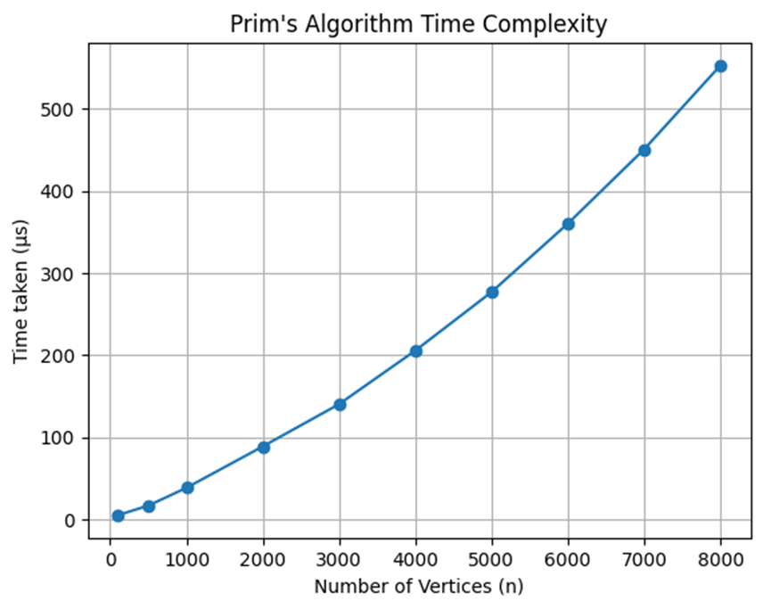

---

### Algorithm
### Algorithm
1. Start  
2. Input graph G(V, E) using adjacency list  
3. Initialize:  
   - Create a priority queue (min-heap) `pq`  
   - Create array `key[]` and initialize all values to ∞  
   - Create array `mstSet[]` and initialize all to false  
   - Set `key[source] = 0`  
4. Insert source vertex into priority queue  
5. While priority queue is not empty do:  
   - Extract vertex `u` with minimum key value  
   - Mark `u` as visited in `mstSet`  
   - For each adjacent vertex `v` of `u`:  
     - If `v` is not in MST and weight(u, v) < key[v]:  
       - Update `key[v] = weight(u, v)`  
       - Insert `v` into priority queue  
6. Repeat until all vertices are included in MST  
7. Stop  


---

### Time Complexity

 Case          Complexity           
 Best Case   :   O(E log V)           
 Average Case : O(E log V)           
 Worst Case  :  O(E log V)           

---

### Space Complexity
- O(V + E) (adjacency list)
- O(V) (MST set and priority queue)

---

### Code
```
void primAlgo(int V, vector<vector<pair<int,int>> >adj)
{
    vector<bool> mstSet(V, false);
   
    priority_queue< pair<int,int>,vector<pair<int,int>>, greater<pair<int,int>> >pq;
    int mstCost=0;

    pq.push({0,0}); 

    while(pq.size()>0)
    {
        auto p = pq.top();
        int wt=p.first;
        int u=p.second;
        pq.pop();

        if(!mstSet[u]){
            mstSet[u]=true;
            mstCost+=wt;

            for(int i=0; i<adj[u].size();i++){
                int v = adj[u][i].first;
                int w = adj[u][i].second;

                if(!mstSet[v])
                pq.push({w,v});
            }
        }
    }
    
}
```

---

### What the Code Does

- The program generates graphs of different sizes using adjacency lists.
- The `generateGraph()` function:
  - Creates a random undirected weighted graph
  - Assigns random weights between vertices
- The `primAlgo()` function:
  - Uses a priority queue (min-heap) to pick the smallest edge
  - Maintains a visited array (`mstSet`)
  - Adds edges to the MST while avoiding cycles
- The process is repeated **50 times** for each graph size to compute average execution time.
- Execution time is measured using the `chrono` library.
- The program outputs the **average time (in milliseconds)** for each input size.

---

### Conclusion
Prim’s Algorithm efficiently constructs a Minimum Spanning Tree using a greedy approach.  
With the use of a priority queue, it achieves a time complexity of **O(E log V)**, making it suitable for large and sparse graphs.  
It is widely used in network design, routing, and optimization problems.

## Practical-23: Kruskal’s Algorithm

### Aim
To implement Kruskal’s Algorithm to find the Minimum Spanning Tree (MST) of a graph.

---

### Theory
A Minimum Spanning Tree (MST) is a subset of edges in a weighted graph that:
- Connects all vertices
- Has no cycles
- Has the minimum possible total edge weight

Kruskal’s Algorithm is a greedy algorithm that:
- Selects edges in increasing order of weight
- Adds an edge only if it does not form a cycle

Steps involved:
- Sort all edges in increasing order of weight
- Pick the smallest edge
- Check if it forms a cycle
- If no cycle → include it in MST
- Repeat until (V - 1) edges are selected

---
### Graph 
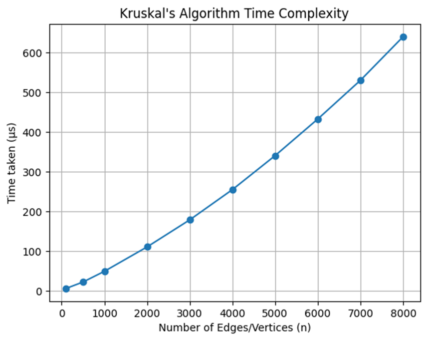

---

### Algorithm
1. Start  
2. Input graph G(V, E)  
3. Sort all edges in non-decreasing order of weight  
4. Initialize MST as empty  
5. For each edge (u, v) in sorted order do:  
   - Check if including edge forms a cycle  
   - If no cycle:  
     - Add edge (u, v) to MST  
6. Repeat until MST contains (V - 1) edges  
7. Stop  

---

### Time Complexity

 Case          Complexity 
 Best Case   :   O(E log E) 
 Average Case : O(E log E) 
 Worst Case  :  O(E log E) 

---

### Space Complexity
- O(V + E)

---

### Code
```
struct edge
{
    int u, v, weight;

    bool operator>(const edge &second) const
    {
        return weight > second.weight;
    }
};

bool isCycle(int curr, int end, vector<bool> &visit, const vector<vector<int>> &adj)
{
    if (curr == end)
    {
        return true;
    }

    visit[curr] = true;

    for (int neighbour : adj[curr])
    {
        if (!visit[neighbour])
        {
            if (isCycle(neighbour, end, visit, adj))
            {
                return true;
            }
        }
    }
    return false;
}

void kruskal(int v, const vector<edge> &edges)
{
    priority_queue<edge, vector<edge>, greater<edge>> minHeap;

    for (auto e : edges)
    {
        minHeap.push(e);
    }
    vector<vector<int>> adj(v);
    vector<edge> mst;
    int minCost = 0;

    while (!minHeap.empty() && mst.size() < v - 1)
    {
        edge currEdge = minHeap.top();
        minHeap.pop();

        vector<bool> visit(v, false);

        if (!isCycle(currEdge.u, currEdge.v, visit, adj))
        {
            mst.push_back(currEdge);
            minCost += currEdge.weight;

            adj[currEdge.u].push_back(currEdge.v);
            adj[currEdge.v].push_back(currEdge.u);
        }
    }
}
```

---

### What the Code Does

- The program defines an `edge` structure with source, destination, and weight.
- A min-heap (priority queue) is used to always pick the smallest edge.
- The `isCycle()` function:
  - Uses DFS to detect if adding an edge creates a cycle
- The `kruskal()` function:
  - Extracts edges from the min-heap
  - Checks for cycles
  - Adds valid edges to MST
  - Keeps track of total cost
- The algorithm stops when (V - 1) edges are added.

---

### Key Concept

Cycle detection using DFS:
- Before adding an edge (u, v), check if a path already exists between u and v.
- If yes → adding edge creates cycle → reject it.

---

### Output

- Prints edges included in MST
- Displays total minimum cost


---

### Conclusion
Kruskal’s Algorithm efficiently finds the Minimum Spanning Tree using a greedy approach.  
It ensures minimum total cost while avoiding cycles.  
However, cycle detection using DFS is less efficient compared to Union-Find, which is preferred for large graphs.

---


# Practical-30: N-Queens Problem

### Aim
To solve the N-Queens problem using Backtracking and print all possible solutions.

---

### Theory
The N-Queens problem is a classic problem in computer science where the goal is to place **N queens on an N×N chessboard** such that:

- No two queens attack each other  
- No two queens are in the same row  
- No two queens are in the same column  
- No two queens are on the same diagonal  

Backtracking is used to solve this problem:
- Place queens one row at a time  
- Check if the current position is safe  
- If safe → place queen and move to next row  
- If not safe → try next column  
- If no column works → backtrack  

---

### Algorithm
1. Start  
2. Input number of queens `n`  
3. Initialize array `x[n]` to store queen positions  
4. Define function `place(k, i)`:
   - For each previous queen `j = 0 to k-1`:
     - If `x[j] == i` OR `abs(x[j] - i) == abs(j - k)`:
       - Return false  
   - Return true  
5. Define recursive function `NQueen(k, n)`:
   - For column `i = 0 to n-1`:
     - If `place(k, i)` is true:
       - Set `x[k] = i`  
       - If `k == n-1`:
         - Print solution  
       - Else:
         - Call `NQueen(k + 1, n)`  
6. Call `NQueen(0, n)`  
7. Stop  

---

## Graph
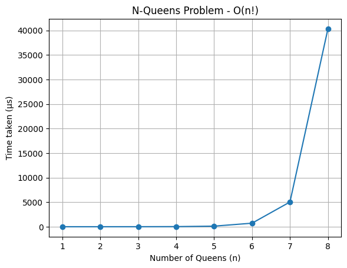

### Time Complexity

| Case          | Complexity |
|--------------|-----------|
| Best Case    | O(n!) |
| Average Case | O(n!) |
| Worst Case   | O(n!) |

---

### Space Complexity
- O(n) (for storing positions of queens)
- O(n) (recursion stack)

---

### Code
```
bool place(int k, int i, vector<int> &x)
{
    for (int j = 0; j < k; j++)
    {
        if (x[j] == i || abs(x[j] - i) == abs(j - k))
        {
            return false;
        }
    }
    return true;
}

void NQueen(int k, int n, vector<int> &x)
{
    for (int i = 0; i < n; i++)
    {
        if (place(k, i, x))
        {
            x[k] = i;
            if (k == n - 1)
            {
                for (int j = 0; j < n; j++)
                {
                    cout << x[j] << " ";
                }
                cout << endl;
            }
            else
                NQueen(k + 1, n, x);
        }
    }
}
```

---

### What the Code Does

- The program takes input `n` (number of queens).  
- Uses a vector `x[]` to store column positions of queens.  
- The `place()` function:
  - Checks if a queen can be placed safely  
  - Ensures no conflicts in column or diagonal  
- The `NQueen()` function:
  - Recursively places queens row by row  
  - Uses backtracking when a conflict occurs  
- When a valid arrangement is found:
  - The positions of queens are printed  

---

### Conclusion
The N-Queens problem is efficiently solved using Backtracking.  
It systematically explores all possible configurations and eliminates invalid ones early.  
Although the time complexity is high, it demonstrates the power of recursion and constraint-based problem solving.

## Practical-31: Sum of Subsets

### Aim
To find all subsets of a given set of weights whose sum is equal to a given target using Backtracking.

---

### Theory
The Sum of Subsets problem is a classic backtracking problem where the goal is to find all subsets whose sum equals a given value.

Given:
- A set of weights  
- A target sum `m`  

We need to:
- Find all possible subsets whose total sum equals `m`  

Backtracking approach:
- Include or exclude each element  
- Explore all possible combinations  
- Prune branches that cannot lead to a valid solution  

Bounding conditions are used to improve efficiency:
- If current sum exceeds target → stop exploring  
- If remaining elements cannot reach target → prune  

---

### Algorithm
1. Start  
2. Input number of elements `n`  
3. Input weights array `w[]`  
4. Input target sum `m`  
5. Compute total sum `r` of all elements  
6. Initialize solution array `x[]`  
7. Define function `sumofSubset(s, k, r)`:
   - Set `x[k] = 1` (include element)  
   - If `s + w[k] == m`:
     - Print current subset  
   - Else if `k+1 < n` AND `s + w[k] + w[k+1] <= m`:
     - Call `sumofSubset(s + w[k], k+1, r - w[k])`  
   - If `k+1 < n` AND `s + r - w[k] >= m` AND `s + w[k] <= m`:
     - Set `x[k] = 0` (exclude element)  
     - Call `sumofSubset(s, k+1, r - w[k])`  
8. Call `sumofSubset(0, 0, totalSum)`  
9. Stop  

---
## Graph
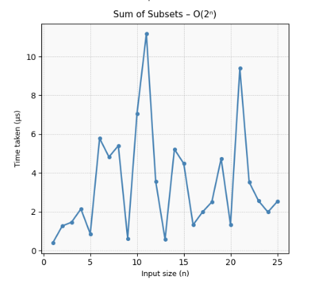

### Time Complexity

| Case          | Complexity |
|--------------|-----------|
| Best Case    | O(2ⁿ) |
| Average Case | O(2ⁿ) |
| Worst Case   | O(2ⁿ) |

---

### Space Complexity
- O(n) (solution vector)
- O(n) (recursion stack)

---

### Code
```
void sumofSubset(int s, int k, int r)
{
    x[k] = 1;

    if (s + w[k] == m)
    {
        for (int i = 0; i <= k; i++)
        {
            if (x[i] == 1)
            {
                cout << w[i] << " ";
            }
        }
        cout << endl;
    }
    else if (k + 1 < n && s + w[k] + w[k + 1] <= m)
    {
        sumofSubset(s + w[k], k + 1, r - w[k]);
    }

    if (k+1<n && s + r - w[k] >= m && s + w[k] <= m)
    {
        x[k] = 0;
        sumofSubset(s, k + 1, r - w[k]);
    }
}
```

---

### What the Code Does

- The program takes:
  - Number of elements `n`  
  - Weights array `w[]`  
  - Target sum `m`  
- Computes total sum of elements  
- Uses array `x[]` to track inclusion/exclusion  
- The `sumofSubset()` function:
  - Recursively explores subsets  
  - Includes/excludes elements  
  - Uses bounding conditions to prune search space  
- When a valid subset is found:
  - It prints the subset elements  

---


### Conclusion
The Sum of Subsets problem is efficiently solved using Backtracking with pruning.  
Although the worst-case time complexity is exponential, bounding conditions significantly reduce unnecessary computations.  
It demonstrates the power of recursive problem solving and constraint satisfaction.

# Practical-32: M-Coloring Problem

## Aim
To implement the M-Coloring problem using Backtracking and print all possible valid colorings of a graph.

---

## Theory
The M-Coloring problem is a graph coloring problem where we assign colors to vertices such that:

- No two adjacent vertices have the same color  
- At most `m` colors are used  

This problem is solved using **Backtracking**:
- Assign colors one by one to vertices  
- Check if the assignment is valid  
- If not valid, try another color (backtrack)  

---

## Algorithm 

1. Start  
2. Input number of vertices `n`  
3. Input number of colors `m`  
4. Input adjacency matrix `adj[1..n][1..n]`  
5. Initialize color array `x[1..n] = 0`  

6. Define function `NextValue(k)`:
   - Repeat:
     - Set `x[k] = (x[k] + 1) mod (m + 1)`  
     - If `x[k] == 0`, return  
     - For `j = 1 to n`:
       - If `adj[k][j] == 1` AND `x[k] == x[j]`, break  
     - If `j == n + 1`, return  
   - Until valid color is found  

7. Define function `mColoring(k)`:
   - Repeat:
     - Call `NextValue(k)`  
     - If `x[k] == 0`, return  
     - If `k == n`, print solution  
     - Else call `mColoring(k + 1)`  
   - Until all possibilities are explored  

8. Call `mColoring(1)`  
9. Stop  

---

## Time Complexity

| Case          | Complexity |
|--------------|-----------|
| Best Case    | O(mⁿ) |
| Average Case | O(mⁿ) |
| Worst Case   | O(mⁿ) |

---

## Graph
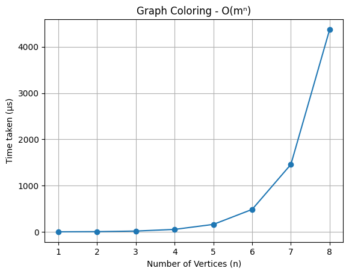

## Space Complexity
- O(n) (color array)  
- O(n) (recursion stack)  

---

### Code
```
void NextValue(int k)
{
    do
    {
        x[k] = (x[k] + 1) % (m + 1);
        if (x[k] == 0)
        {
            return;
        }
        int j;
        for (j = 1; j <= n; j++)
        {
            if (adj[k][j] == 1 && x[k] == x[j])
            {
                break;
            }
        }
        if (j == n+1)
            return;

    } while (1);
}

void mColoring(int k)
{
    do
    {
        NextValue(k);

        if (x[k] == 0)
        {
            return;
        }
        if (k == n)
        {
            for (int i = 1; i <= n; i++)
            {
                cout << x[i] << " ";
            }
            cout << endl;
        }
        else
            mColoring(k + 1);

    } while (1);
}
```

---

## What the Code Does

- Takes number of vertices and colors as input  
- Accepts adjacency matrix of the graph  
- Uses backtracking to assign colors to vertices  
- Ensures adjacent vertices do not share the same color  
- Prints all valid color combinations  

---

## Conclusion
- The M-Coloring problem is efficiently solved using Backtracking.
- It explores all possible color assignments while ensuring constraints are satisfied.
- Although the time complexity is high (O(mⁿ)), it guarantees all valid solutions.

# Practical-33: Hamiltonian Cycle

## Aim
To find all Hamiltonian cycles in a given graph using Backtracking.

---

## Theory
A Hamiltonian Cycle is a cycle in a graph that:

- Visits each vertex exactly once  
- Returns to the starting vertex  

The problem is to determine all such possible cycles in a given graph.

Backtracking approach:
- Start from a fixed vertex  
- Add vertices one by one  
- Ensure:
  - No vertex is repeated  
  - There exists an edge between consecutive vertices  
- Check if last vertex connects back to the first  

If constraints fail → backtrack  

---

## Algorithm 

1. Start  
2. Input number of vertices `n`  
3. Input adjacency matrix `adj[1..n][1..n]`  
4. Initialize array `x[1..n] = 0`  
5. Set starting vertex `x[1] = 1`  

6. Define function `NextValue(k)`:
   - Repeat:
     - Set `x[k] = (x[k] + 1) mod (n + 1)`  
     - If `x[k] == 0`, return  
     - If there is an edge between `x[k-1]` and `x[k]`:
       - Check for repetition:
         - For `j = 1 to k-1`:
           - If `x[j] == x[k]`, break  
       - If no repetition:
         - If `(k < n)` OR `(k == n AND edge exists between x[n] and x[1])`:
           - Return  

   - Until valid vertex is found  

7. Define function `Hamiltonian(k)`:
   - Repeat:
     - Call `NextValue(k)`  
     - If `x[k] == 0`, return  
     - If `k == n`:
       - Print Hamiltonian cycle  
     - Else:
       - Call `Hamiltonian(k + 1)`  
   - Until all possibilities are explored  

8. Call `Hamiltonian(2)`  
9. Stop  

---

## Graph


## Time Complexity

| Case          | Complexity |
|--------------|-----------|
| Best Case    | O(n!) |
| Average Case | O(n!) |
| Worst Case   | O(n!) |

---

## Space Complexity
- O(n) (solution array)  
- O(n) (recursion stack)  

---

### Code
```
void NextValue(int k)
{
    do
    {
        x[k] = (x[k] + 1) % (n + 1);
        if (x[k] == 0)
        {
            return;
        }
        if (adj[x[k - 1]][x[k]] != 0)
        {
            int j;
            for (j = 1; j <= k-1; j++)
            {
                if (x[j] == x[k])
                {
                    break;
                }
            }
            if (j == k)
            {
                if (k < n || (k == n && adj[x[n]][x[1]] != 0))
                {
                    return;
                }
            }
        }

    } while (1);
}

void Hamiltonian(int k)
{
    do
    {
        NextValue(k);

        if (x[k] == 0)
        {
            return;
        }
        if (k == n)
        {
            for (int i = 1; i <= n; i++)
            {
                cout << x[i] << " ";
            }
            cout<<x[1];
            cout << endl;
        }
        else
            Hamiltonian(k + 1);

    } while (1);
}
```

---

## What the Code Does

- Takes number of vertices and adjacency matrix as input  
- Fixes starting vertex to avoid duplicate cycles  
- Uses backtracking to generate permutations of vertices  
- Ensures:
  - No vertex is repeated  
  - Consecutive vertices are connected  
  - Last vertex connects back to first  
- Prints all Hamiltonian cycles  

---

## Conclusion 
- The Hamiltonian Cycle problem is solved using Backtracking by exploring all possible vertex permutations.
- Although the time complexity is high (O(n!)), it guarantees finding all valid cycles.
- It is a classic example of constraint-based combinatorial problems.